# Projet Gîte Rain du Pair

Ce projet est une application web développée avec Symfony pour la location d'un gîte. 
L'objectif est de fournir une plateforme conviviale permettant aux utilisateurs de rechercher, réserver et gérer leurs séjours.
C'est mon projet d'examen pour le passage du titre professionnel Développeur Web et Web Mobile.

## Fonctionnalités principales

- Encart de recherche en temps réel : Affiche les dates disponibles à la réservationlors de la recherche.
- Détail complet de la prestation : Affiche les détails complets du gîte ainsi que les informations sur les prix.
- Inscription / Connexion / Déconnexion : Permet aux utilisateurs de s'inscrire, de se connecter et de se déconnecter.
- Formulaire de réservation : Permet aux utilisateurs de réserver un séjour dans un gîte.
- Système de paiement en ligne : Intègre un système de paiement en ligne sécurisé pour effectuer les réservations.

 ## Fonctionnalités supplémentaires
 
- Laisser un avis : Les utilisateurs ayant déjà séjourné dans un gîte peuvent laisser un avis sur le site.
- Formulaire de contact : Permet aux utilisateurs d'envoyer une demande par e-mail au propriétaire.
- Tableau de bord administrateur : Permet à l'administrateur de gérer le site, modifier les informations sur les gîtes, ajouter des photos, suivre les réservations et afficher leurs détails.
- Tableau de bord utilisateur : Permet aux utilisateurs de gérer leur compte, modifier leur mot de passe, afficher leurs réservations et télécharger leur facture.
- Envoi de mail automatique : Envoi automatique d'e-mails aux clients et à l'administrateur lors d'une réservation.
- Intégration des derniers posts Instagram : Affiche les dernières publications Instagram pour présenter les actualités du logement.
- Intégration des activités à promouvoir : Intègre des informations sur les activités à promouvoir autour du gîte.
- Pages de Mentions légales et conditions générales, Sitemap

## Aperçu

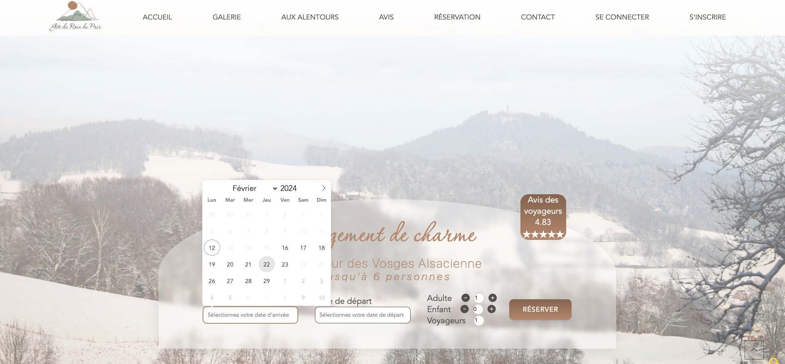
Recherche de réservation
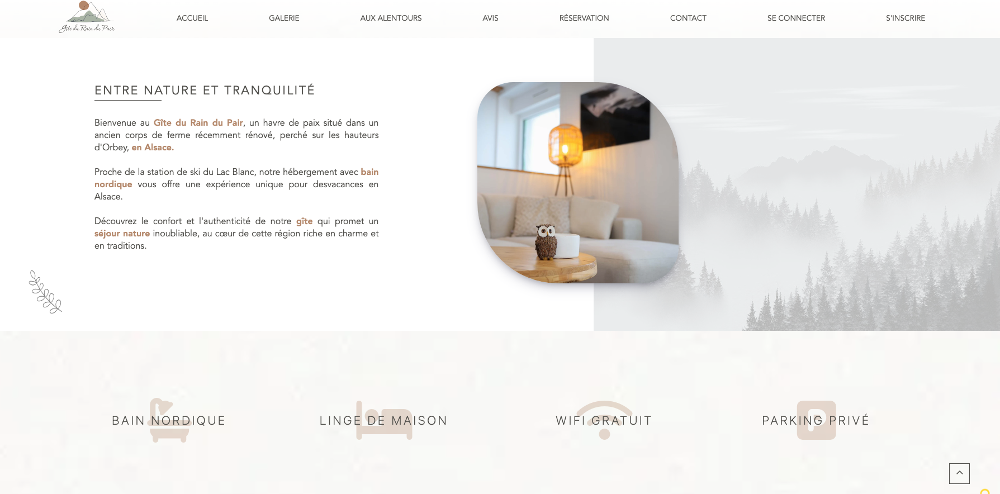
Page d'accueil
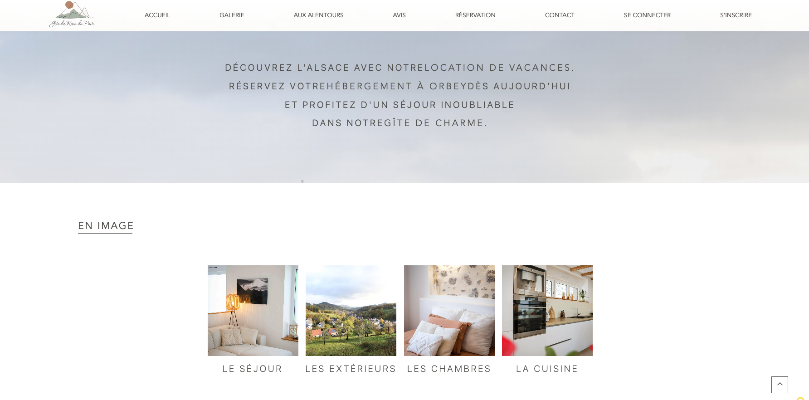
Page d'accueil - Galerie photos
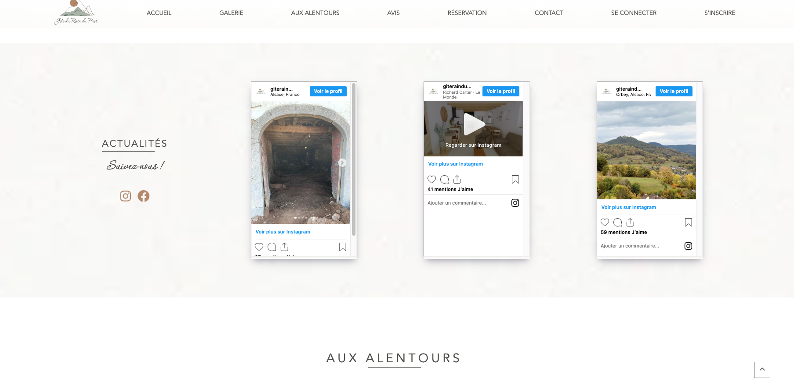
Page d'accueil - Actualités
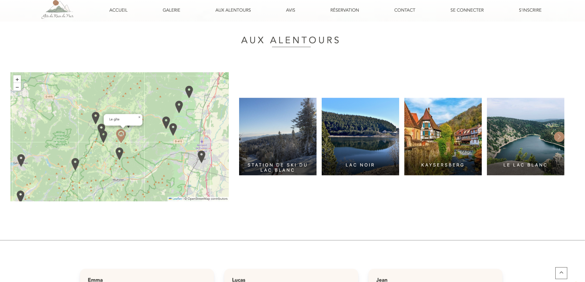
Page d'accueil - Activités
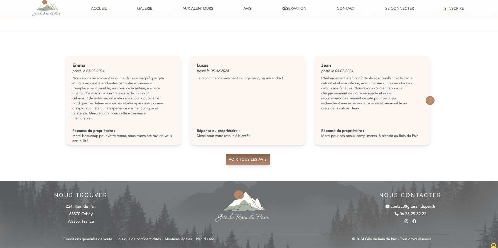
Page d'accueil - Avis
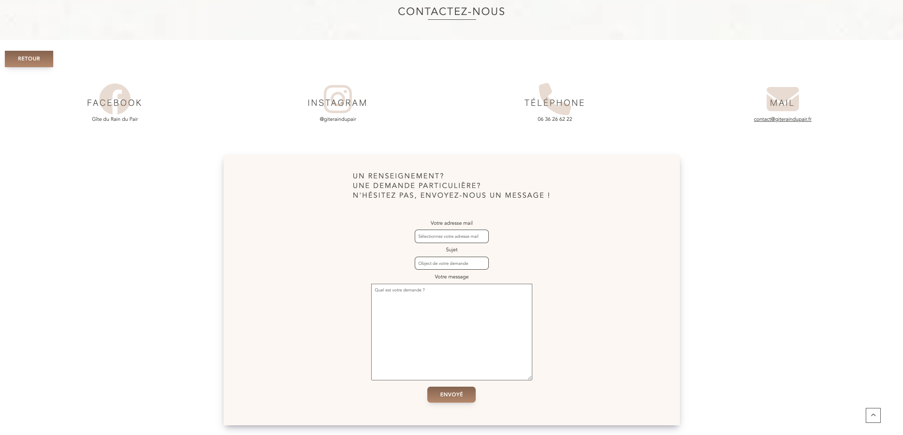
Page de contact
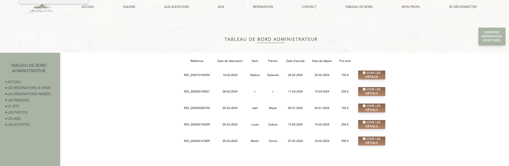
Tableau de bord administrateur
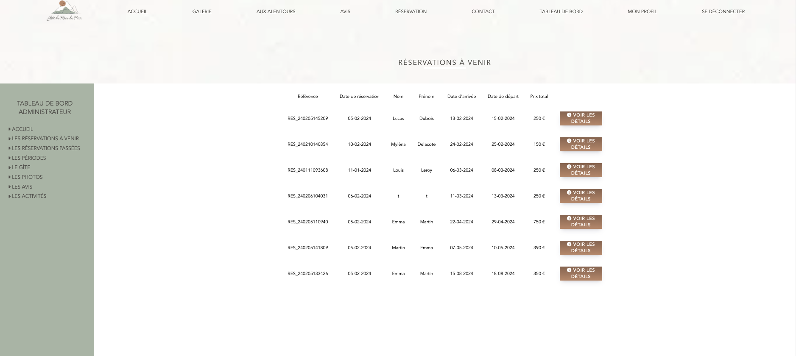
Tableau de bord administrateur - les réservations à venir
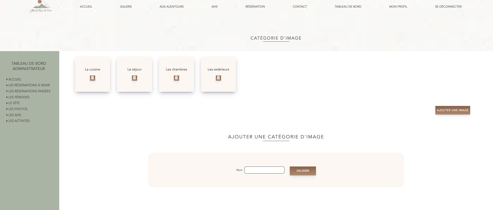
Tableau de bord administrateur - Ajout de photos
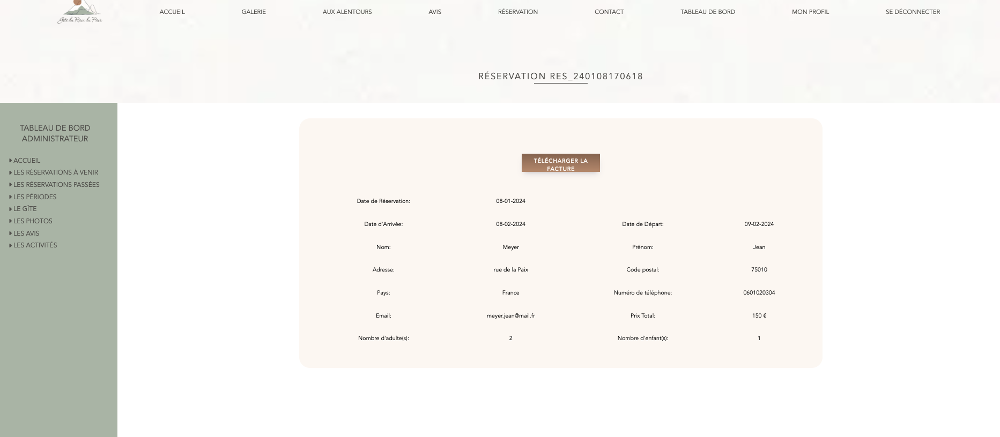
Tableau de bord administrateur - les détails d'une réservation

